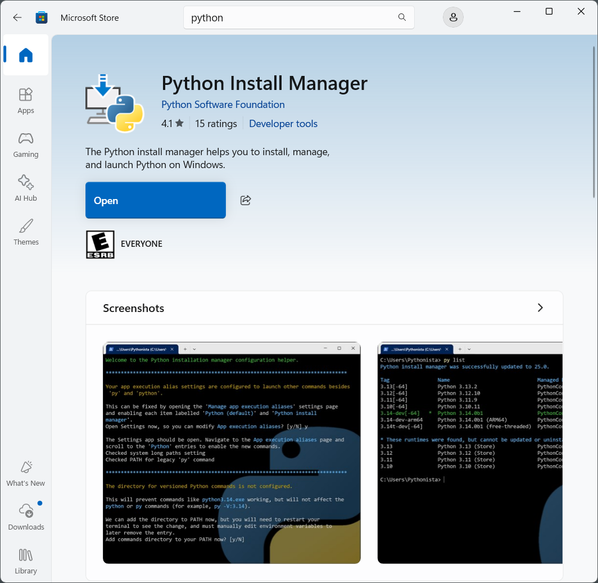
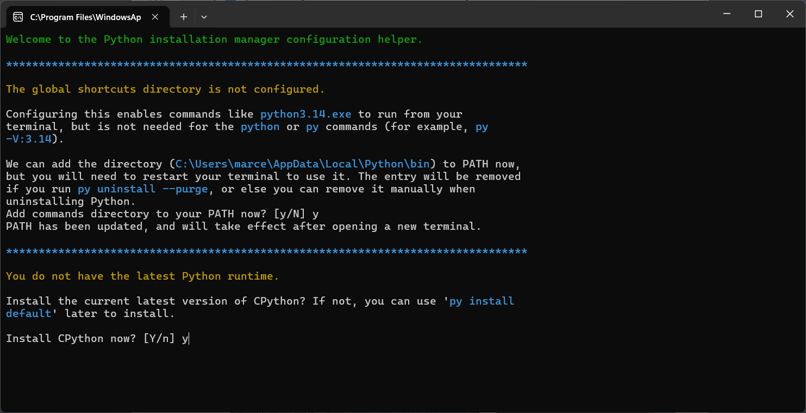
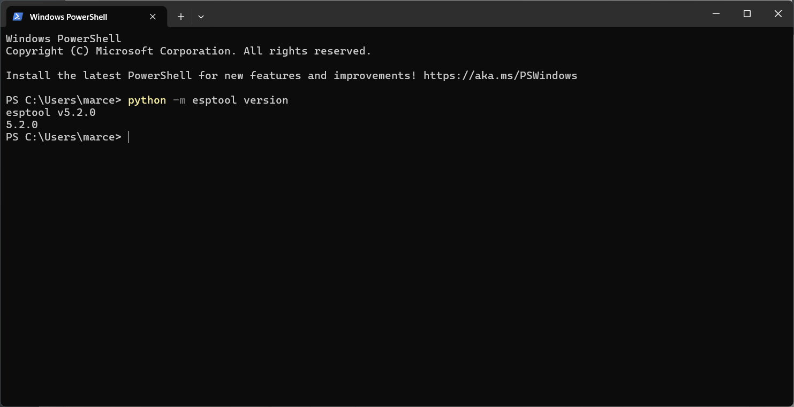
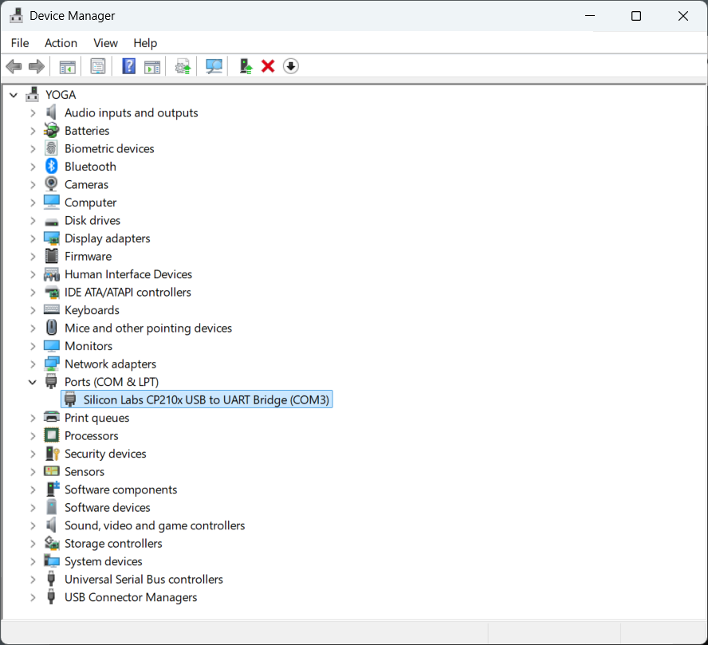
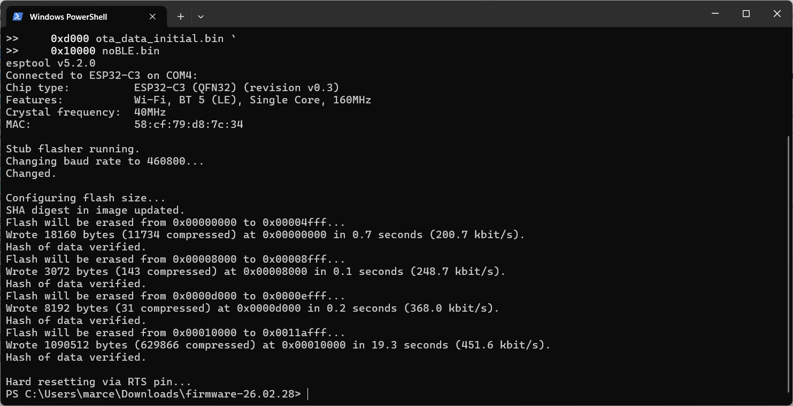

# 1. Introduction

This document describes how to manually install the noBLE firmware image into an ESP32 device. 

In most cases this process needs to be done only once when bringing up a new ESP32 device, as once the noBLE firmware is installed and running, the device can upgrade the firmware by itself over the Internet using the "OTA Update" feature.

While the firmware install process is fairly simple, it does require a few things to be in place for it to work smoothly.  If you follow the steps in this guide carefully and in the right order, you should have noBLE running on your new device in no time.

<br>

# 2. What you will need

* A Windows PC with Internet connectivity and an available USB port.
* An ESP32 device that uses one of the following SoC's: ESP32-C3, ESP32-C6, ESP32-S3.
* A USB cable to plug the ESP32 device to the PC. Make sure it is a “data” cable and not a “charging-only” cable.
* The noBLE firmware image for your specific ESP32 device.

In his document we use an [ESP32-C3 DevKitM-1](https://docs.espressif.com/projects/esp-dev-kits/en/latest/esp32c3/esp32-c3-devkitm-1/user_guide.html) device, but the process is essentially the same if you have an ESP32-C6 or an ESP32-S3 DevKit.

> [!TIP]
> To protect the pins on the DevKit device from damage or accidental short circuits, it is recommended that the DevKit be plugged on a small solderless breadboard. A [170-pin breadboard](https://www.digikey.com/en/products/detail/bud-industries/BB-32650-W/10518730) works well for the ESP32-C3 DevKitM-1 used in this document.

If your Windows PC has a Python 3 runtime environment already installed, you can skip the following section and jump to section #4.

<br>

# 3. Install Python

The noBLE firmware is installed using the **esptool** command-line app.  This app is written in Python, so it can run on any platform that has a Python 3 runtime environment available.

Windows 10/11 does not come with Python preinstalled, so unless you have already installed it for other purposes, you will need to install it now.  The good news is that Python is free and easy to install.

On Windows you can install Python in two different ways:

* Directly from the [MS Store](https://apps.microsoft.com/detail/9nq7512cxl7t?ocid=webpdpshare)
* Downloading the installer for the latest stable release from the official Python web site [python.org](https://www.python.org/downloads/windows)

In this tutorial we will install Python using the Microsoft Store app.

Open the Microsoft Store app and search for “python install”.  You should get this:

<br>


<br>

Press the blue Get button and wait until the software is downloaded and installed.  When the process is complete, the Get button should change to Open:

<br>



<br>

When you click the Open button a Command Prompt window will automatically open up, to ask you a few questions about some post-install options.  See the screenshots below:

<br>


<br>



<br>


<br>

To check that the installation was successful, open a PowerShell terminal and run the command:

```
python --version
```

which simply prints the version number and exits. In this example the version installed was 3.14.3:

<br>


<br>

> [!TIP]
> While the following step is not strictly necessary, at this point you may want to update Python's installer "pip" to the latest version, so that it stops printing the message "A new release of pip is available ..." each time you run it:

```
python -m pip install --upgrade pip
```

<br>

# 4. Install the esptool

In this step we are going to install the Python package **esptool** that contains, among other things, the tool we will use to install the firmware.  In the PowerShell terminal, simply type the command:

```
python -m pip install esptool
```

To check that the installation was successful, run the command:

```
python -m esptool version
```

which simply prints the app's version number and exits. In this example the version installed was 5.2.0:

<br>



<br>

# 5. Install the USB driver

> [!NOTE]
> This step is required only when the ESP32 device you have uses a USB chip for which Windows does not have a native driver preinstalled.  That is the case of the ESP32-C3 DevKit used in this tutorial, which uses a Silicon Labs CP210x USB chip that requires a custom Windows driver.

Instructions to download and install the Silicon Labs CP210x driver can be found [here](https://www.silabs.com/software-and-tools/usb-to-uart-bridge-vcp-drivers?tab=downloads).

<br>

# 6. Plug the ESP32 device

Use a USB data cable to plug the ESP32 device into an available USB charging port on your Windows PC, and ensure that the small red LED on the ESP32-C3 DevKit lits up indicating that it is getting power.

Open the Windows Device Manager app and expand the Ports (COM & LPT) category.  You should see an entry for the USB port where the ESP32 device is plugged in, and in parenthesis the COM port number Windows assigned to it.  If your ESP32 device uses the Silicon Labs CP210x USB chip, the entry should look like this:

<br>



<br>

> [!IMPORTANT]
> Take note of the COM port number assigned to the ESP32 device (COM3 in this example), as we will need it in the next step when flashing the firmware.

<br>

# 7. Install the firmware

We are finally ready to write the firmware image into the flash memory of the ESP32 device.  This process is referred to as "flashing" the firmware.

The noBLE firmware is distributed as a ZIP file with the name "firmware-YY-MM-DD.zip", where YY-MM-DD indicates the version number.  

Once you download and unzip the file, use the PowerShell terminal to go to the folder "firmware-YY-MM-DD" where the files were extracted, and run the following command:

> [!IMPORTANT]
> 1. When you copy-paste the command, make sure to include the back tick "`" characters at the end of the lines, which are used by the PowerShell as line-continuation markers.
> 
> 2. Replace the argument COMx for the actual COM port number obtained in step #6.
>
> 3. When you paste the command data into the PowerShell terminal, you may get a warning message saying that "You are about to paste text that contains multiple lines." Ignore it and press the "Paste anyway" button.

```
python -m esptool --chip esp32c3 -p COMx -b 460800 `
    --before=default-reset --after=hard-reset `
    write-flash --flash-mode dio --flash-freq 80m --flash-size 4MB `
    0x0 bootloader.bin `
    0x8000 partition-table.bin `
    0xd000 ota_data_initial.bin `
    0x10000 noBLE.bin
```

If the command completes successfully, the last message printed should say:

```
Hard resetting via RTS pin...
```

<br>



<br>

Upon restarting running the noBLE firmware, the ESP32 device will use its RGB LED to give the user visual hints about its operational state:

1. First it shows a $${\color{red}RED}$$ &rarr; $${\color{yellow}YELLOW}$$ &rarr; $${\color{green}GREEN}$$ sequence, as a "Ready, Set, Go" indication.
2. Then it attempts to connect to the WiFi network, but because the new device has not been configured yet, it  starts blinking the RGB LED $${\color{magenta}MAGENTA}$$ 4 times per second, to warn the user.

The WiFi credentials, among many other things, are configured using the **noBLE Companion** app, discussed in detail [here](https://github.com/choripan-systems/Documentation/blob/main/nobleComp/App-Install-On-Windows.md).

