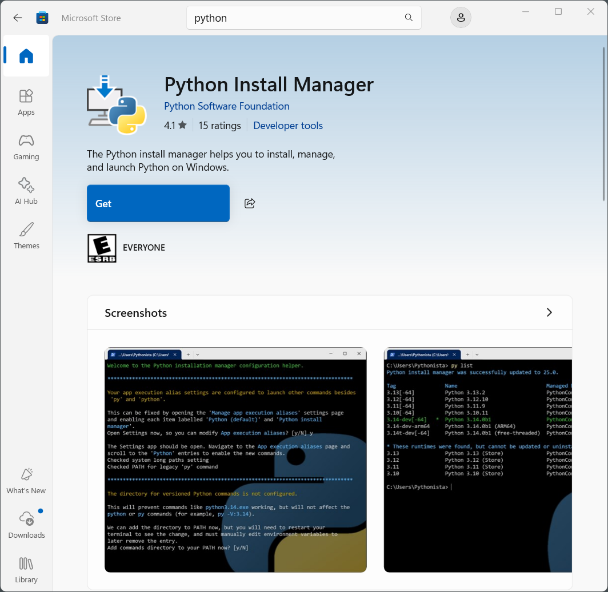
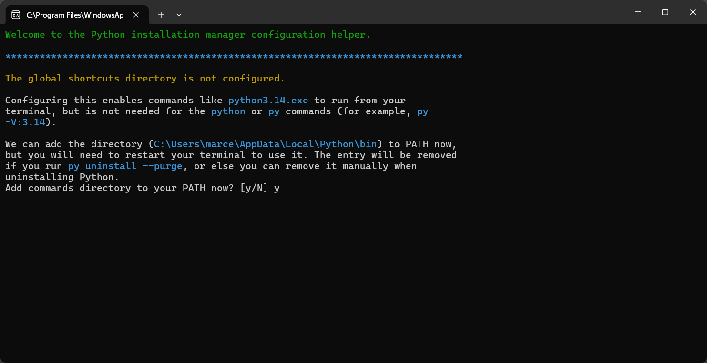
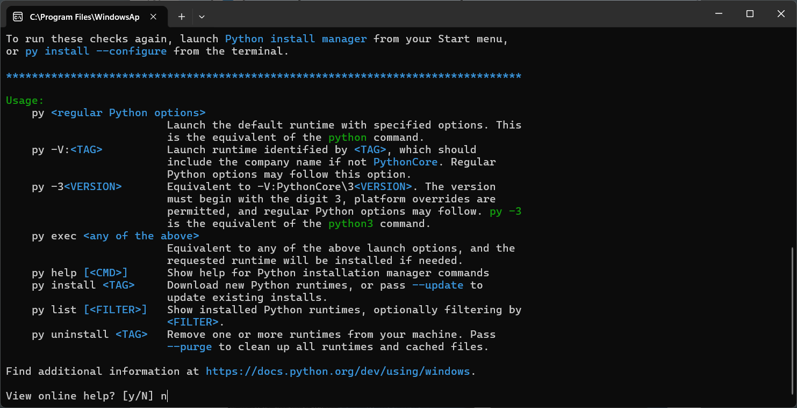
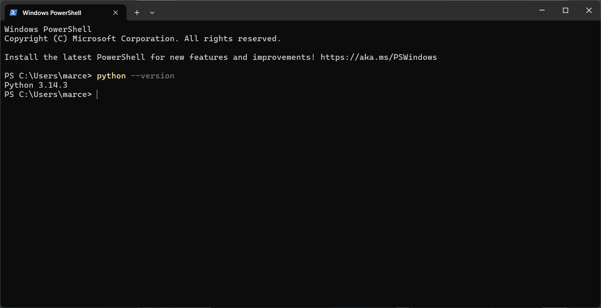
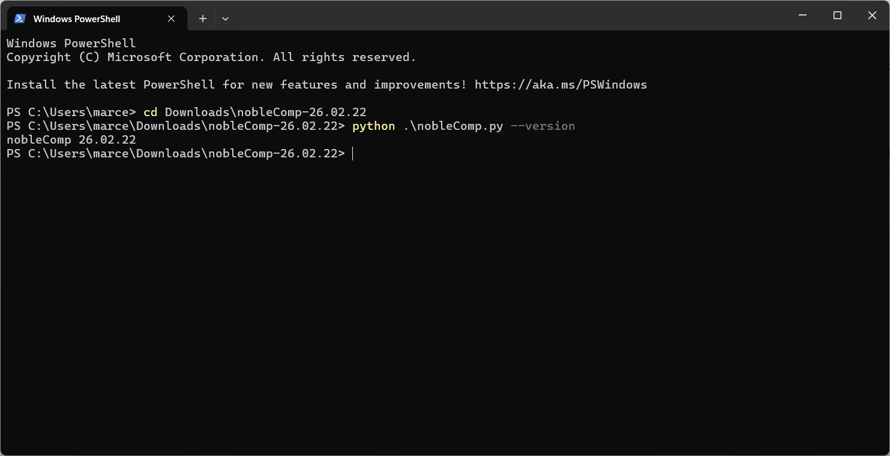
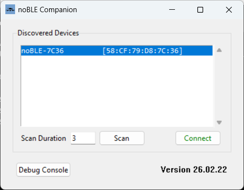
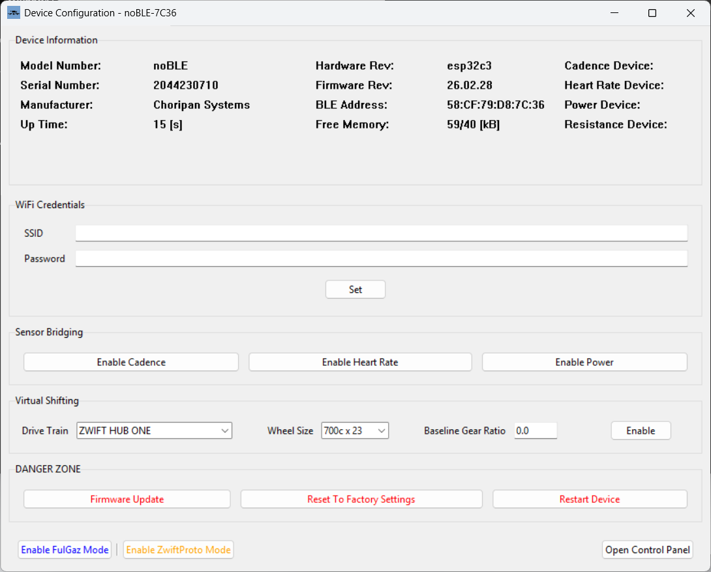
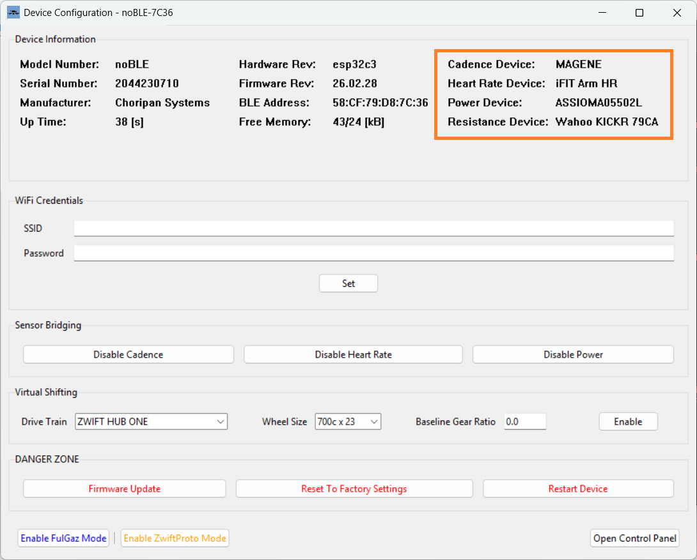

# 1. Introduction

The noBLE Companion app is used to configure and control a noBLE device.  

The app is written in Python, so it can run on any platform that has a Python 3 runtime environment available. If your Windows PC has a Python 3 runtime environment already installed, you can skip the following section and jump to section #3.

<br>

# 2. Install Python

Windows does not come with Python preinstalled, so unless you have already installed it for other purposes, you will need to install it now.  The good news is that Python is free and easy to install.

On Windows you can install Python in two different ways:

* Directly from the [MS Store](https://apps.microsoft.com/detail/9nq7512cxl7t?ocid=webpdpshare)
* Downloading the installer for the latest stable release from the official Python web site [python.org](https://www.python.org/downloads/windows)

In this tutorial we will install Python using the Microsoft Store app.

Open the Microsoft Store app and search for “python install”.  You should get this:

<br>



<br>

Press the blue Get button and wait until the software is downloaded and installed.  When the process is complete, the Get button should change to Open:

<br>


<br>

When you click the Open button a Command Prompt window will automatically open up, to ask you a few questions about some post-install options.  See the screenshots below:

<br>



<br>


<br>



<br>

To check that the installation was successful, open a PowerShell terminal and run the command:

```
python --version
```

which simply prints the version number and exits. In this example the version installed was 3.14.3:

<br>



<br>

> [!TIP]
> While the following step is not strictly necessary, at this point you may want to update Python's installer "pip" to the latest version, so that it stops printing the message "A new release of pip is available ..." each time you run it:

```
python -m pip install --upgrade pip
```

The noBLE Companion app uses a few optional Python packages that can be installed as follows:

```
python -m pip install bleak pyserial qrcode pillow
```

<br>

# 3. Install the noBLE Companion app

The nobleComp app is distributed as a ZIP file with the name "nobleComp-YY-MM-DD.zip", where YY-MM-DD indicates the version number. Once you unzip the file, use the PowerShell terminal to go to the folder "nobleComp-YY-MM-DD" where the files were extracted, and run the following command to ensure the app was properly installed: 

```
python .\nobleComp.py --version
```

<br>



<br>

> [!TIP]
> The supplied file "nobleComp.vbs" is a Visual Basic Script that can be used to create a desktop shortcut to launch the nobleComp app by simply double-clicking the shortcut.

<br>

# 4. Using the noBLE Companion app

Launching the nobleComp app with the option --auto-scan will cause the app to start scanning for noBLE devices within reach.  By default the BLE scan lasts for 3 seconds, but it can be extended if needed.  Each device discovered is shown in the list box, with the first (and usually only) noBLE device discovered pre-selected:

```
python .\nobleComp.py --auto-scan
```

<br>



<br>

Pressing the green Connect button will cause nobleComp to connect to the selected noBLE device, and to read its current configuration and state, which is shown on the Device Configuration window.  When connecting to a brand new device all the settings will be at their factory defaults:

<br>



<br>

The Device Information frame at the top of the window shows, among other things, the serial number of the device, and the version of the firmware that it is running.

To set the credentials required to allow the noBLE device to connect to the WiFi network, simply enter the SSID (31 characters max) and the password (63 characters max) in the respective fields and press the Set button.  

> [!IMPORTANT]
> The ESP32 only supports WiFi networks that operate in the 2.4 GHz band, and that support at least WAP2 authentication.

The RBG LED will briefly blink cyan 4 times a second while the device connects to the WiFi network.  Once it successfully connects to the network, the LED will turn solid cyan, and the WiFi credentials will get stored in non-volatile memory (NVRAM) to be used to auto-connect to the network whenever the device restarts.

noBLE can bridge up to three BLE sensor devices; e.g. heart rate monitor, pedal or crank power meter, crank arm cadence sensor. If you intend to use noBLE to bridge any of these devices, you can press the corresponding button in the Sensor Bridging frame to enable the feature.  

> [!TIP]
> The BLE devices that noBLE discovered and paired with are shown in the Device Information frame.

<br>



<br>

